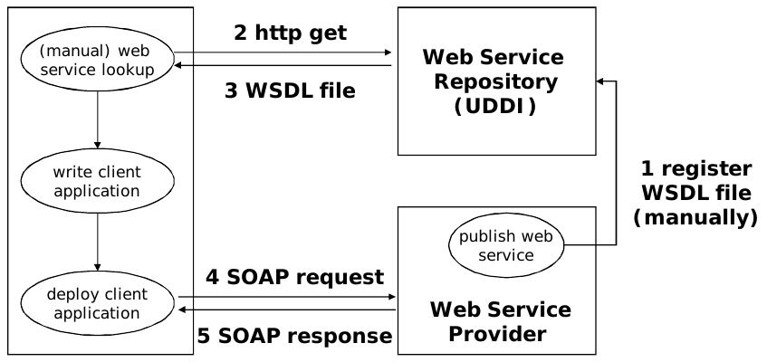
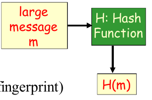

# CSCU9YW

[TOC]


# Introduction

## Origins

- Distributed computing for
  - Linking networked computers and applications
  - Sharing computation
  - Sharing data
- Previous approaches
  -  Java RMI (Remote Method Invocation)
  - OMG CORBA (Common Object Request Broker Architecture)
  - Microsoft DCOM (Distributed Component Object Model)
  - ODP (Open Distributed Model)
- Web was rapidly adopted as a means to share information,
  initially through static web pages, later dynamic and
  interactive web pages
- Web focussed on accessing information
- Web services focus on B2B communication

## Characteristics

- Jeff Bezos (CEO Amazon), Tech. Review 01/2005
  – “Web 1.0 was making the Internet for people; Web 2.0 is making the
  Internet better for computers”
- Gartner Research,
  – “Web services are loosely coupled software components delivered over
  Internet standard technologies”
- emphasise communication among applications rather than users
- follow open standards that are widely supported by industry
- architecture is loosely coupled, so web services can be designed in
  isolation
- can interwork even if they were not explicitly designed to do so
- supported by three classes of system: service consumers (clients),
  service providers (servers), and service brokers (registries)

## What is a Web Service?

- A web service is a network accessible interface to application
  programs, built using standard Internet technologies.
- Clients of web services do **NOT** need to know how it is implemented.
- A Web Service is a URL-addressable software resource that performs
  functions (or a function).


- "Web services are a new breed of Web application. They are self-contained, self-describing, modular applications that can be published, located, and invoked across the Web. Web services perform functions, which can be anything from simple requests to complicated business processes. ... Once a Web service is deployed, other applications (and other Web services) can discover and invoke the deployed service.” IBM web service tutorial

## Example – booking a trip 

### WWW/HTML


### Web Services


## Evolution

| Technology | Purpose         | Applications     | Outcome         |
| ---------- | --------------- | ---------------- | --------------- |
| TCP/IP     | Connectivity    | E-mail, FTP, ... | Create the web  |
| Html       | Presentation    | Web pages        | Browse the web  |
| XML        | Programmability | Web services     | Program the web |

## Usage

- Web services are used by business for managing
  partnerships
  - supply chains (e.g. a brake manufacturer automatically maintains stock levels of parts for a car manufacturer)
  - outsourcing (e.g. an electronics manufacturer has its web pages managed by an IT company)
  - contracting (e.g. an Internet shop goes to tender for management of online purchases)
  - combined services (e.g. a travel agent uses the services of airlines, hotel chains and car rental companies to offer a complete travel booking service)

- Web services support virtual organisations across the boundaries of conventional organisations

## Web services standards

- standards for web services are defined by a number of
  organisations such as:
  - IETF (Internet Engineering Task Force, www.ietf.org)
  - OASIS (Organization for The Advancement of Structured
    Information Standards, www.oasis-open.org)
  - W3C (World Wide Web Consortium, www.w3.org)
- web services share certain communication mechanisms
  with conventional use of the Web:
  - HTTP (HyperText Transfer Protocol, IETF RFC 2616) to support message exchange between web services
  - TCP (Transmission Control Protocol, IETF RFC 793) for reliable transfer of data across a collection of subnetworks (e.g. the Internet)
  - IP (Internet Protocol, IETF RFC 791) for routing across a collection of subnetworks

- many web service aspects have been (or are being) standardised in areas such as:
  - service description
  -  service discovery
  - service addressing
  -  security and authentication
  -  reliable messaging and transaction
  -  service orchestration and choreography
  -  service policies


## Web service usage


### Example



## Web Services Implementation

- Drastically simplified!
- Application Server (web service-enabled)
  - provides implementation of services and exposes it through WSDL/SOAP
  - implementation in Java, as EJB, as .NET (C#) etc.
- SOAP server, implements the SOAP protocol
- HTTP server, standard Web server
- SOAP client, implements the SOAP protocol on the client site


### Examples

- http://aws.amazon.com/
  - Exposes world’s largest product database through Web Services
  - Idea: let others figure out how to sell products for us
  - Associates program enables Web sites to link to Amazon.com and earn
    referral fees
- Some other interesting examples:
  - http://www.nbn.org.uk/Use-Data/Examples-Of-Use/Web-services.aspx
  - http://blog.elgg.org/pg/blog/cash/read/149/example-of-site-integration-using-web-services

## SOA/SOC

- web services support what is generically called SOA (Service Oriented Architecture) in support of SOC
  (Service Oriented Computing)
- SOC views a distributed system from the perspective of the services it offers and how these relate to each other
- previous work on distributed computing was object oriented, but this describes the (close) coupling among distributed objects
- instead, web services maintain a loose coupling – only the services offered by a distributed application are exposed:
  - legacy applications can easily be given a web service wrapping
  - the internal design of a web service can readily be changed
  - new services can be created by combining existing services

## Background: XML

- Meta-language
- XML uses markup to describe data.
  - So it is used to develop our own markup languages.
- Text files
- XML and HTML are for different purposes.
  - HTML is concerned with display (e.g. <body>, <p>, <ul>)
  - XML is concerned with data representation
- The markup facilities in HTML are predefined
- In XML we define our own!

```xml
<pets>
    <animal>
        <type>Dog</type>
        <name>Jasper</name>
        <disposition>Enthusiastic</disposition>
    </animal>
    <animal>
        <type>Cat</type>
        <name>Barney</name>
        <disposition>Cynical</disposition>
    </animal>
</pets>
```

- XML attributes further define elements:

  - ```xml
    <price currency="GBP">1.15</price>
    ```

  - ```xml
    <price currency="USD">1.75</price>
    ```

- Required vs #Implied

- Well formed vs valid XML

- Two ways to specify the structure of XML documents:

  - Document Type Definitions (DTDs)
  - XML Schemas

- We need to specify

  - what elements (tags) will be used
  -  how the various elements may be nested
  -  what attributes they may contain
  -  what types of data an element can contain

## DTD vs Schemas

- DTDs are rather limited in how they describe the content of data (e.g. it cannot be stated that a particular element contains integers or strings)
- XSD (XML Schema Definition, W3C version 1.0) is now the preferred way to define applications of XML, giving:
  - the structural elements in the data, defining the types of data they contain
  - definitions of data types, including sophisticated constraints on their contents
  - the relationships among the structural elements
  - the attributes of elements
- XSI (XML Schema Instance, W3C version 1.0) defines XML documents as instances of their schemas

## Namespaces

- a namespace is essentially just a unique string, though namespaces typically take the form of a URI (Uniform Resource Indicator)
- a namespace URI is typically a URL (Uniform Resource Locator) for where a schema is defined (e.g. www.cs.stir.ac.uk/schemas/mustard.xsd)
- a namespace URI may simply be a URN (Uniform Resource Name) that gives a (relatively) unique identifier (e.g. urn:MustardDefinition)
- since a namespace URI may be lengthy, it is commonly referred to by a short prefix – a string that is unique only within a document (e.g. mstd)

### Defining a Namespace

- namespace prefixes are defined and used as follows (xmlns
  means XML NameSpace):
  - xmlns:mstd=“www.cs.stir.ac.uk/schemas/mustard.xsd”
  - ...
  - mstd:sequence
- mstd:sequence is an example of using a namespace prefix
- a document may declare a default namespace (xmlns on its own) for elements and attributes that are used without an explicit namespace prefix
- a document may also declare a target namespace (targetNamespace) that applies to all elements and attributes that it defines
- it is often convenient to have a prefix corresponding to the target namespace; this is typically, but need not be, named tns
- the namespace prefix for XML Schema Definition is usually xsd (though sometimes xs), while that for XML Schema Instance is usually xsi

## XML Schema

- With a schema, instead of having a definition in a file such as note.dtd, it is held in a file note.xsd
- When the XML file is specified by an XSD document held in note.xsd, the attributes within the note element in the XML file are:

```xml
<note
    xmlns="http://www.w3schools.com"
	xmlns:xsi="http://www.w3.org/2001/XMLSchema-instance"
	xsi:schemaLocation="http://www.w3schools.com note.xsd"
>
```

- The notation is therefore in XML.
- We have also defined namespaces.
- The default namespace in this example is: http://www.w3schools.com
- Let us now look at the structure of the XSD document.
- The `<schema>` element is the root element of every XML Schema and it normally has attributes.
- The following specifies that elements and data types used in the schema (schema, element, complexType, sequence, string, boolean, etc.) come from the 
  namespace: http://www.w3.org/2001/XMLSchema
- and that the elements and data types from that namespace
  should be prefixed with xs:

```xml
<xs:schema 
	xmlns:xs="http://www.w3.org/2001/XMLSchema"
    targetNamespace="http://www.w3schools.com"
    xmlns="http://www.w3schools.com"    
    elementFormDefault="qualified"
>
```

- elements used by a XML document which are declared in this schema must be namespace **qualified**

### Example

The root element in our XML is note. Suppose that it is composed of a sequence of four elements to, from, heading and body, it is an example of a complex element and its definition has the structure:

```xml
<xs:element name="note">
    <xs:complexType>
        <xs:sequence>
        	...
        </xs:sequence>
    </xs:complexType>
</xs:element>

```

- The term sequence indicates that the inner elements must appear in the specified order.

## XML Schema Datatypes

- XML Schema have a lot of built-in data types.
  Examples are:
  - xs:string
  - xs:decimal
  - xs:integer
  - xs:boolean
  - xs:date
  - xs:time
- This gives us a lot more control than we had with DTDs to specify what can go into our XML document. If the XML document contains a value of the wrong type then it will not validate.

### Example

- Suppose that we had the following simple elements in XML:

```xml
<lastname>Smith</lastname>
<age>36</age>
<dateborn>1968-03-27</dateborn>
```

-  Note that date is given as YYYY-MM-DD
- The corresponding simple element definitions in XSD are:

```xml
<xs:element name="lastname" type="xs:string"/>
<xs:element name="age" type="xs:integer"/>
<xs:element name="dateborn" type="xs:date"/>
```

In our **note** example, the inner elements are built-in simple elements. Their definition has the structure:

```xml
<xs:element name="aname" type="atype"/>
```

In fact, they are all strings. Hence the full definition of note is:

```xml
<xs:element name="note">
    <xs:complexType>
        <xs:sequence>
            <xs:element name="to" type="xs:string"/>
            <xs:element name="from" type="xs:string"/>
            <xs:element name="heading" type="xs:string"/>
            <xs:element name="body" type="xs:string"/>
        </xs:sequence>
    </xs:complexType>
</xs:element>
```

## Defining new types

- So, here we have defined a new element called note and described its structure.
- It has an anonymous type.
- An alternative would be to define a new complexType (e.g. NoteType) and then define the note element as:

```xml
<xs:element name= "note" type= "NoteType"/>
```

This approach is much better if we are going to have several elements with the same structure (type).

### A new type

- We now define NoteType as:

```xml
<xs:complexType name="NoteType">
    <xs:sequence>
        <xs:element name="to" type="xs:string"/>
        <xs:element name="from" type="xs:string"/>
        <xs:element name="heading" type="xs:string"/>
        <xs:element name="body" type="xs:string"/>
    </xs:sequence>
</xs:complexType>
```

### Another new type

- We can also define a new **simpleType**.
- We start from an existing **simpleType** (the base type) and impose a *restriction* by means of a **facet**.
- Example facets are:
  -  maxInclusive and maxExclusive
  -  minInclusive and minExclusive
  -  pattern
  -  enumeration

## Restrictions on types

- Suppose that we wanted to restrict the range of allowable values in our age element.
- Instead of defining it as:

```xml
<xs:element name="age" type="xs:integer"/>
```

- We can define it as:

```xml
<xs:element name="age">
    <xs:simpleType>
        <xs:restriction base="xs:integer">
            <xs:minInclusive value="13"/>
            <xs:maxInclusive value="19"/>
        </xs:restriction>
    </xs:simpleType>
</xs:element>
```

- Further examples

  ```xml
  <xs:element name="car">
      <xs:simpleType>
          <xs:restriction base="xs:string">
              <xs:enumeration value="Audi"/>
              <xs:enumeration value="Golf"/>
              <xs:enumeration value="BMW"/>
          </xs:restriction>
      </xs:simpleType>
  </xs:element>
  ```

  ```xml
  <xs:element name="initials">
      <xs:simpleType>
          <xs:restriction base="xs:string">
          	<xs:pattern value="[A-Z][A-Z]"/>
          </xs:restriction>
      </xs:simpleType>
  </xs:element>
  ```

- Can also define default or fixed values for a type:

  ```xml
  <xs:element name="color" type="xs:string" default="red"/>
  <xs:element name="color" type="xs:string" fixed="red"/>
  ```

# XML Schema summary

- schema data types use the following:
  - predefined types like boolean, date, double, float, int, integer (arbitrary length),
    nonNegativeInteger, string, time
  - element for a field in a type
  - complexType for structured types

```xml
<complexType name="fieldCount">
    <sequence>
        <element name="field" type="xsd:string"/>
        <element name="count" type="xsd:nonNegativeInteger"/>
    </sequence>
</complexType>

<complexType name="analysis">
    <sequence>
    	<element name="fieldCount" type="defs:fieldCount" minOccurs="0" maxOccurs="unbounded"/>
    </sequence>
</complexType>

```

# WSDL

## Web services

- a service supports:
  - ports whose interfaces are defined by port types
  - operations at ports that can take an input, return an output, and cause a fault
  - messages that are sent to or by an operation
  - faults that indicate failure of the service (not the underlying communications)


- note that
  - different operations with the same name (e.g. add here) may be supported at different ports
  - operation parameters are optional, e.g. an operation may not produce an output, may send an output without an input, or may not cause a fault
  - although a web service may offer multiple ports, each with multiple operations, in practice services have just one port with multiple operations

### Calculator class

```java
public class Calculator {
    public int add(int i, int j) throws ArithmeticException {
    	int result = i + j;
    	if ((j >= 0 && result >= i) || (j < 0 && result < i))
    		return(result);
    	else
    		throw new ArithmeticException(”addition overflow”);
    }
    
    public int subtract(int i, int j) throws ArithmeticException {
    	int result = i - j;
    	if ((j >= 0 && result <= i) || (j < 0 && result > i))
    		return(result);
    	else
    		throw new ArithmeticException(”subtraction overflow”);
    }
}
```

- Equivalent web service look as follows:
  - a Calculator service with a calculator port
  - operations add and subtract for a pair of
    integers
  - messages for the input and output of these
    operations
  - fault ArithmeticException for the case where
    the result of addition or subtraction is too large
- note that Java does not have the explicit equivalent of a port or of messages
- Axis2 (Apache Extensible Interaction System) is able to convert a simple Java class into a web service (POJO)

## WSDL

- Web Service Definition Language (XML)
- Namespace is typically wsdl
- A WSDL document describes how to interact with a web service in terms of data types, operations provided and their parameters, protocols used, location of the service
- WSDL deals with syntax (how to call operations) and not semantics (what operations do), so other information is needed before a service can be fully understood
- Contract between service provider and requestor
- Described services can be implemented in any language & on any platform

### Uses

- Used by application developers as a spec of the web service
  - Helps with development of both web services and web service clients
  - Source code for (parts of) service and client can be generated from WSDL
  - WSDL can also be generated from a web service implementation
- Used by applications to invoke a web service
  - Dynamically generating a call to the web service based on its description
- Published in service registries
  - Aids discovery and use of web services
- WSDL-described web service can be communicated with using any agreed protocol
  - SOAP (most common)
  - SMTP/MIME
  - HTTP/REST (used for simple cases)

### WSDL messages

- Web services handle messages in one of two basic styles:
  - document style means that each message carries an XML document
  - rpc style (cf. remote procedure) means that a request message carries the name of the operation to be invoked plus its parameters, and the resulting response message carries the operation result
- Each of these has two encodings:
  - encoded means that the types of all values are explicitly stated
  - literal means that values are just given literally – types are implicit
- In practice, only the literal styles are used
- Disadvantage of document/literal over rpc/literal: operations cannot be overloaded (different operations cannot have the same parameters)

### WSDL documents

- WSDL separates the abstract description of a service interface from how it is actually supported
- The Abstract Service Interface Definition
  - Describes what the web service does (what operations it offers)
- The Concrete Service Implementation
  - Binds the abstract operations to concrete protocols; how to call those operations using those protocols
- Services support one or more ports (typically just one)
- Each port supports one or more operations
- Each operation may have an input, an output, and zero or
  more faults

### Abstract Service Definition

- Data types used by the service
  - Typically XML Schema type definitions
  - Simple types, e.g.: int, float, string, boolean, etc...
  - Complex types, e.g.: Customer, Address, Stock Item
  - Types are used within messages...
- Messages sent/received by the service
  - A message is the payload of a single, one-way communication
  - A message consists of one or more parts
  - Each part is of a certain data type (as defined in data types)
  - Messages are used to make operations...
- How messages combine to form operations
  - At most one input message (input parameters)
  - At most one output message (output parameters)
  - Optional fault descriptions (exceptions)
  - WSDL supports four operation types...
- Operations combine to form a portType

### Operation Types


### Port Types

- Operations are combined to a portType
  - describes the interface(s) of a Web service
  - represent a logical aggregation of operations

```xml
<definitions>
    <types>
    	data type definitions........
    </types>
    <message>
    	definition of the data being communicated....
    </message>
    <portType>
    	set of operations......
    </portType>
    <binding>
    	protocol and data format specification....
    </binding>
</definitions>
```

## Concrete Service Implementation

- Concrete bindings of the abstract service interface definition
  - Describe an implementation of a portType
  - Input, output and fault messages in the ops of each port type are mapped to:
    - The transport protocol(s) used
    - The message style (document or rpc)
    - The data encoding style (encoded or literal)
  - Although binding information has to be repeated for each port and operation
    parameter, these are usually all the same
- Overall Service is defined
  - Name of service
  - Each port has a name, binding and a location
- The entire Web Service is exposed via one or more ports (end point)
  - Each binding corresponds to a single port
  - A port is the actual address where the service can be found, eg:
    - http://some.web/service if binding to HTTP
    - some.web@service.com if binding to SMTP

## Tools for WSDL

- all packages for web services include support for WSDL
- Apache Axis2 (Apache Extensible Interaction System) supports:
  - parsing WSDL, and interpreting SOAP messages in the context of this
  - WSDL2Java converts from WSDL to Java, creating stubs (outline client code) and skeletons (outline server code)
  - conversely, Java2WSDL converts from Java to WSDL
  - basic XML types have a direct Java mapping (e.g. boolean, double, float, int)
  - more complex XML types map onto Java classes

## Limitations of WSDL

-  Unable to describe complex business processes
  - E.g. sequences of related messages
- Does not describe business level requirements
  of the service
  - E.g. Quality of Service, Security

## Important Namespaces

- The principle WSDL namespaces are:
  - http://schemas.xmlsoap.org/wsdl/ (Version 1.1)
  - http://www.w3.org/ns/wsdl (Version 2.0)
- The namespace for binding to SOAP messaging
  - http://schemas.xmlsoap.org/wsdl/soap/
- XML Schema –for XML Schema data type encoding
  - http://www.w3c.org/2001/XMLSchema
- SOAP Encoding – for SOAP messages using SOAP encoding
  - http://schemas.xmlsoap.org/soap/encoding/
- WSDL documents may also reference other namespaces
  - Usually this will be for application specific purposes

## Overview of WSDL documents


### Examples 

#### Messages and Porttypes

```xml
<message name="getTermRequest">
    <part name="term" type="xs:string"/>
</message>

<message name="getTermResponse">
    <part name="value" type="xs:string"/>
</message>

<portType name="glossaryTerms">
    <operation name="getTerm">
	    <input message="getTermRequest"/>
    	<output message="getTermResponse"/>
    </operation>
</portType>
```

#### Binding

```xml
<binding type="glossaryTerms" name="b1">
    <soap:binding style="document" transport="http://schemas.xmlsoap.org/soap/http" />
    <operation>
        <soap:operation soapAction="http://example.com/getTerm"/>
        <input><soap:body use="literal"/></input>
        <output><soap:body use="literal"/></output>
    </operation>
</binding>
```

### Example: Hello World (Lab 1)

-  WSDL for Hello World Lab Example
- Abstract service definition
- One possible binding to SOAP

#### Definitions

- `<definitions>` is the root element of a WSDL document

```xml
<wsdl:definitions xmlns:wsdl="http://schemas.xmlsoap.org/wsdl/"
    xmlns:ns="http://ws.apache.org/axis2"
    xmlns:wsaw="http://www.w3.org/2006/05/addressing/wsdl"
    xmlns:mime="http://schemas.xmlsoap.org/wsdl/mime/"
    xmlns:http="http://schemas.xmlsoap.org/wsdl/http/"
    xmlns:xs="http://www.w3.org/2001/XMLSchema"
    xmlns:soap12="http://schemas.xmlsoap.org/wsdl/soap12/"
    xmlns:ns1="http://org.apache.axis2/xsd"
    xmlns:soap="http://schemas.xmlsoap.org/wsdl/soap/"
    targetNamespace="http://ws.apache.org/axis2">

<wsdl:documentation>
    This is a first Hello World Service.
</wsdl:documentation>
```

- This document also uses elements defined in a number of other Namespaces, e.g.
  - WSDL (wsdl)
  - Binding WSDL to SOAP (soap)
  - XML Schema (xs)

#### WSDL Types

```xml
<wsdl:types>
    <xs:schema attributeFormDefault="qualified"
    elementFormDefault="qualified" targetNamespace="http://ws.apache.org/axis2">
        <xs:element name="echoMsg">
            <xs:complexType>
                <xs:sequence>
                	<xs:element minOccurs="0" name="arg" nillable="true" type="xs:string" />
                </xs:sequence>
            </xs:complexType>
        </xs:element>
        
        <xs:element name="echoMsgResponse">
            <xs:complexType>
                <xs:sequence>
            	    <xs:element minOccurs="0" name="return" nillable="true" type="xs:string" />
                </xs:sequence>
            </xs:complexType>
        </xs:element>
    </xs:schema>
</wsdl:types>

```

#### WSDL Messages

```xml
<wsdl:message name="echoMsgRequest">
    <wsdl:part name="parameters" element="ns:echoMsg" />
</wsdl:message>

<wsdl:message name="echoMsgResponse">
    <wsdl:part name="parameters" element="ns:echoMsgResponse" />
</wsdl:message>
```

- Two messages are defined:
  - echoMsgRequest is of type “ns:echoMsg”
  - echoMsgResponse is of type “ns:echoMsgResponse”

#### WSDL operations & portType

```xml
<wsdl:portType name="helloWorldWSPortType">
    <wsdl:operation name="echoMsg">
        <wsdl:input message="ns:echoMsgRequest" wsaw:Action="urn:echoMsg" />
        <wsdl:output message="ns:echoMsgResponse" wsaw:Action="urn:echoMsgResponse" />
    </wsdl:operation>
</wsdl:portType>
```

- A portType is declared, it is called “helloWorldWSPortType”
- The portType has only one operation, called “echoMsg”
- This operation consists of:
  - An input which is in the form of the message “ns:echoMsgRequest”
  - An output which is in the form of the message “ns:echoMsgResponse”

#### WSDL: Binding SOAP11

```xml
<wsdl:binding name="helloWorldWSSoap11Binding" type="ns:helloWorldWSPortType">
    <soap:binding transport="http://schemas.xmlsoap.org/soap/http" style="document" />
    <wsdl:operation name="echoMsg">
        <soap:operation soapAction="urn:echoMsg" style="document" />
    	<wsdl:input>
    		<soap:body use="literal" />
    	</wsdl:input>
    	<wsdl:output>
    		<soap:body use="literal" />
    	</wsdl:output>
    </wsdl:operation>
</wsdl:binding>
```

- A binding called “helloWorldWSSoap11Binding” is declared.
- This binds the portType “ns:helloWorldWSPortType” to SOAP11 messaging using the document style and literal data type encoding.
- Each input/output (and fault) of each operation in the portType is bound.
- Two more bindings for SOAP12 (identical to SOAP11 binding, but different namespace) and HTTP

#### WSDL: Binding HTTP

```xml
<wsdl:binding name="helloWorldWSHttpBinding" type="ns:helloWorldWSPortType">
    <http:binding verb="POST" />
    <wsdl:operation name="echoMsg">
        <http:operation location="echoMsg" />
        <wsdl:input>
        	<mime:content type="application/xml" part="parameters" />
        </wsdl:input>
        <wsdl:output>
        	<mime:content type="application/xml" part="parameters" />
        </wsdl:output>
    </wsdl:operation>
</wsdl:binding>
```

#### WSDL: Service

```xml
<wsdl:service name="helloWorldWS">
    <wsdl:port name="helloWorldWSHttpSoap11Endpoint" binding="ns:helloWorldWSSoap11Binding">
		<soap:address location="http://127.0.0.1:8080/axis2/services/helloWorldWS.helloWorldWSHttpSoap11Endpoint/"/>
	</wsdl:port>
	<wsdl:port name="helloWorldWSHttpSoap12Endpoint" binding="ns:helloWorldWSSoap12Binding">
		<soap12:address location="http://127.0.0.1:8080/axis2/services/helloWorldWS.helloWorldWSHttpSoap12Endpoint/"/>
	</wsdl:port>
	<wsdl:port name="helloWorldWSHttpEndpoint" binding="ns:helloWorldWSHttpBinding">
		<http:address location="http://127.0.0.1:8080/axis2/services/helloWorldWS.helloWorldWSHttpEndpoint/" />
	</wsdl:port>
</wsdl:service>
```

- A service called “helloWorldWS” is declared
- The service consists of three ports corresponding to the three bindings

# SOAP

## Introduction

-  Simple Object Access Protocol
- Not a programming language!
- A structured XML message format
- A protocol for exchanging messages
- An encoding scheme for representing data types in those messages
- Uses an underlying transport protocol (HTTP, SMTP etc) through binding


- SOAP provides platform neutral:
  - Message and Information exchanging
  - Invocation of remote functionality
- SOAP enables:
  - Distributed applications
  - Business-to-Business integration
  - Web Services
- SOAP version 1.2
  - W3C Recommendation (standard), April 2007
  - From XML Protocol Working Group
  - http://www.w3.org/TR/soap/

## Why SOAP

- Many applications communicate using Remote Procedure Calls (RPC) between objects like DCOM and CORBA.
- RPC represents a compatibility and security problem; firewalls and proxy servers will normally block this traffic.
- A better way to communicate between applications is over HTTP, because HTTP is supported by all Internet browsers and servers. SOAP was created to accomplish this.
- SOAP provides a way to communicate between applications running on different operating systems, with different technologies and programming languages.

## SOAP messages

- SOAP messages are
  - Stateless
  - One-way
  - Composable, e.g. WSDL operation types
    -  One-way
    -  Request-response
    -  Solicit-response
    -  Notification
  - Transferred between SOAP nodes (apps)

## SOAP nodes

- SOAP Sender
  - Generates & sends the message
- SOAP Receiver
  - Ultimately receives and processes the message
  - May generate a SOAP response, message or fault as a result
- SOAP Intermediary
  - Zero or more
  - Receives, processes (e.g. routes) and resends the message

## SOAP Intermediaries

- Forwarding intermediaries
  - Uses and updates the SOAP header blocks to pass the message (body unchanged) on to the next node
- Active intermediaries
  - Perform additional processing on the SOAP message before sending

## SOAP binding to Transport Protocol

- SOAP messages can be sent in many different ways
  - Over HTTP
  - Over HTTP/SSL
  - Over SMTP
- A binding specifies how SOAP messages are passed using an underlying transport protocol

## SOAP Message structure

- Envelope
  - Identifies that this is a SOAP message.
- Header
  - Optional & application specific
  - Entries may be addressed to a particular SOAP node
- Body
  - Mandatory
  - Contains message “payload”


- Additional components:
- Faults
  - Details of what and where something went wrong
- Attachments
  - E.G. Binary Data (GIF, JPEG, MP3 etc)
  - Typically carried outside envelope
  - Uses Multipurpose Internet Mail Extensions (MIME)

## SOAP Message

```xml
<?xml version="1.0"?>
<soap:Envelope xmlns:soap="http://www.w3.org/2001/12/soap-envelope" soap:encodingStyle="http://www.w3.org/2001/12/soap-encoding">
    <soap:Header> ... ... </soap:Header>
    <soap:Body> ... ...
    	<soap:Fault> ... ... </soap:Fault>
    </soap:Body>
</soap:Envelope>
```

- Note Namespace
- Encoding defines data types

## SOAP Header

- attributes
  - soap:mustUnderstand

```xml
<soap:Header>
	<m:Trans xmlns:m="http://www.w3schools.com/transaction/" soap:mustUnderstand="1">234 </m:Trans>
</soap:Header>
```

## SOAP Body

- Request

```xml
<?xml version="1.0"?>
<soap:Envelope xmlns:soap="http://www.w3.org/2001/12/soap-envelope"
soap:encodingStyle="http://www.w3.org/2001/12/soap-encoding">
	<soap:Body>
        <m:GetPrice xmlns:m="http://www.w3schools.com/prices">
            <Item>Apples<Item>
        </m:GetPrice>
    </soap:Body>
</soap:Envelope>
```

- Response

```xml
<?xml version="1.0"?>
<soap:Envelope xmlns:soap="http://www.w3.org/2001/12/soap-envelope" soap:encodingStyle="http://www.w3.org/2001/12/soap-encoding">
    <soap:Body>
        <m:GetPriceResponse xmlns:m="http://www.w3schools.com/prices">
        	<Price>1.90</Price>
        </m:GetPriceResponse>
    </soap:Body>
</soap:Envelope>

```

## SOAP Faults

- Fault elements consists of:
  - `<faultcode>` A code for identifying the fault
  -  `<faultstring>` A human readable explanation of the fault
  -  `<faultactor>` Information on who caused the fault to happen
  -  `<detail>` Application specific error information related to the Body element
- Fault codes
  - VersionMismatch: Found an invalid namespace for the SOAP Element
  - MustUnderstand: An immediate child element of the Header element, with the mustUnderstand attribute set to "1", was not understood
  - Client: Message was incorrectly formed or contained incorrect information
  - Server: Problem with the server, the message could not proceed

## Communication

- SOAP provides two communication models
- SOAP RPC
  - Synchronous request-response
  - Request encodes method & arguments
  - Response encodes result value or fault
- SOAP Messaging (document)
  - Document-driven: XML
  - Normal XML description e.g. of products can be sent
  - No reference to operation names
  - Operations must have a single element
  - Confusion: Synchronous and/or asynchronous messaging

### SOAP RPC

- The Request body describes
  - The name of the method to invoke
  - Optional arguments to pass to that method
- Includes the WSDL operation
- Parameters are based on WSDL types
- WSDL operations can include one or more parts
- May be identified by order and/or by name
- The Response body describes
  - The return value(s) from the method or
  - SOAP fault

### SOAP Message (document)

- Each message body is an XML document or “literal
  XML”
  - can be validated against pre-defined XML schema document
  - A body element type typically identifies the message type
  - And therefore how/by what it should be handled
- No Operation name in SOAP message
- Parts of a message are based on schema element definitions rather than WSDL types
- Operations have a single part

### RPC vs Message

- RPC is function-centric
  - RPC has tight coupling between the message
    and the implementation
- Messaging is data-centric
  - Messaging has loose coupling between the message and the implementation

### Data encoding

- Literals: XML fragments, defined in XML Schema
  - Commonly used in XML messaging scenarios
- Encoded values: defined in SOAP Encoding
  - A set of rules for representing data types (not supported in Axis2)
- Defines standard XML encoding for commonly observed programming language types
  - Simple types, Enumerations
  - Compound types, e.g. structs, objects
  - Arrays, References

### Examples

- suppose a service supports an add operation that accepts two integers (i, j) and returns their sum; it may also report a ‘result too large’ fault

#### rpc/literal

```xml
<soap:Envelope>
    <soap:Body>
        <add>
            <i>12</i>
            <j>5</j>
        </add>
    </soap:Body>
</soap:Envelope>
```

```xml
<soap:Envelope>
    <soap:Body>
        <addResponse>
        	<res>17</res>
        </addResponse>
    </soap:Body>
</soap:Envelope>

```

- request to add 12 to 5 defines arguments by name, and wraps them in the operation (add) 
- response must be a data structure even if a simple type is being returned; conventionally this is the operation name with Response appended

```xml
<soap:Envelope>
    <soap:Body>
        <add>
            <operands>
                <i>12</i>
                <j>5</j>
            </operands>
        </add>
    </soap:Body>
</soap:Envelope>
```

```xml
<soap:Envelope>
    <soap:Body>
        <addResponse>
        	<res>17</res>
        </addResponse>
    </soap:Body>
</soap:Envelope>
```

- request now wraps two parameters in an operands element inside the operation (add)
- response unchanged

#### Fault in rpc/literal

```xml
<soap:Envelope>
    <soap:Body>
        <soap:Fault>
            <soap:faultcode> soap:Sender</soap:faultcode>
            <soap:faultstring>Addition result too large</soap:faultstring>
            <soap:faultactor>http://aws.xyz.com/lists</soap:faultactor>
        </soap:Fault>
    </soap:Body>
</soap:Envelope>
```

### Document /literal

- Same request
- Missing operation
- Must have single element as parameter

```xml
<soap:Envelope>
    <soap:Body>
        <operands>
            <i>12</i>
            <j>5</j>
        </operands>
    </soap:Body>
</soap:Envelope>
```

```xml
<soap:Envelope>
    <soap:Body>
    	<res>17</res>
    </soap:Body>
</soap:Envelope>
```

### rpc/encoded & document/encoded

- Broadly resemble their literal counterparts
- however, the encoded variants include explicit type information and may make use of multiRefs
- a multiRef is really intended for the case where there are multiple references to a value
- this might happen through structures sharing a value, or through a type referring to itself directly or indirectly (e.g. a linked list)
- a multiRef is like a separate value identified by an id where the value might have appeared, an href (hyper-reference) refers to the multiRef definition

## Data encoding

- Literals: XML fragments, defined in XML Schema
  - Commonly used in XML messaging scenarios
- Encoded values: defined in SOAP Encoding
  - A set of rules for representing data types
  - Commonly used in RPC scenarios
- Defines standard XML encoding for commonly observed
  programming language types
  - Simple types, Enumerations
  - Compound types, e.g. structs, objects
  - Arrays, References
- Leads to the following combinations: RPC literal, RPC SOAP
  encoding, Document literal

## Basic Example (Hello World)

```java
public class SimpleHelloService {
    public String echoMsg(String arg) {
	    return arg.toUpperCase();
    }
}
```

```http
POST /axis2/services/helloWorldWS.helloWorldWSHttpSoap12Endpoint/ HTTP/1.1
Content-Type: application/soap+xml; charset=UTF-8; action="urn:echoMsg"
User-Agent: Axis2
Host: 139.153.254.167:8080
Transfer-Encoding: chunked
```

```xml
<?xml version='1.0‘ encoding='UTF-8‘ ?>
<soapenv:Envelope xmlns:soapenv="http://www.w3.org/2003/05/soap-envelope">
    <soapenv:Header/>
    <soapenv:Body>
        <ns1:echoMsg xmlns:ns1="http://ws.apache.org/axis2">
    	    <ns1:arg> Hello my world!! </ns1:arg>
        </ns1:echoMsg>
    </soapenv:Body>
</soapenv:Envelope>
```

## SOAP Envelope

- `<Envelope>` is the root element of a SOAP message
  - Declared using the namespace: http://www.w3.org/2003/05/soap-envelope
  - Identifies that this is a SOAP message
- If `<Envelope>` is not the root element, or the namespace is not correct, a SOAP application will generate a fault

## SOAP Header & Body

- The `<Header>` is optional, it may be used to extend a SOAP message
  for application specific reasons
- If present, the `<Header>` must be the first child of `<Envelope>`
- The `<Header>` can contain one or more entries, typical uses include:
  - Authentication/Security
  - Transaction management
- There is exactly one `<Body>`, a child of SOAP `<Envelope>`
- These are the “payload” of the message
  - RPC method and its parameters
  - Target application (receiver) specific data
  - SOAP fault for reporting errors/status

## The Response

```http
HTTP/1.1 200 OK
Server: Apache-Coyote/1.1
Content-Type: application/soap+xml; action="urn:echoMsgResponse";charset=UTF-8
Transfer-Encoding: chunked
Date: Sun, 24 Jan 2016 11:23:45 GMT\
```

```xml
<?xml version="1.0" encoding="UTF-8" ?>
<soapenv:Envelope xmlns:soapenv="http://www.w3.org/2003/05/soap-envelope">
    <soapenv:Body>
	    <ns:echoMsgResponse xmlns:ns="http://ws.apache.org/axis2">
            <ns:return>
                HELLO MY WORLD!!
            </ns:return>
    	</ns:echoMsgResponse>
    </soapenv:Body>
</soapenv:Envelope>
```

## AddTwoNumbers examples

- Possible implementations for the Web service “AddTwoNumbers”
- All examples show SOAP messages transferred by HTTP (SOAP over HTTP)
- In each example the semantics of the messages are the same, but the implementation differs in:
  - The SOAP communication model used
  - The data type encoded used.
- Communication model: RPC; Data type encoding: Literal

## RPC/literal

### Request

```http
POST /axis/services/AddNumbersServer HTTP/1.0
Content-Type: text/xml; charset=utf-8
Accept: application/soap+xml, application/dime
User-Agent: Axis/1.4
Host: localhost:8090
Cache-Control: no-cache
SOAPAction: “”
Content-Length: 362
```

```xml
<?xml version="1.0" encoding="UTF-8" ?>
<soapenv:Envelope xmlns:soapenv="http://schemas.xmlsoap.org/soap/envelope/"
    <soapenv:Body>`
        <ns1:addTwoNumbersOperation xmlns:ns1="http://localhost:8080/axis/AddTwoNumbers">
            <a>4.0</a>
            <b>3.0</b>
        </ns1:addTwoNumbersOperation>
    </soapenv:Body>
</soapenv:Envelope>
```

### Response

```http
HTTP/1.1 200 OK
Cache-Control: no-cache
Content-Type: text/xml; charset=iso-8859-1
Content-Length: 365
Server: Jetty(6.1.5)
```

```xml
<?xml version="1.0" encoding="UTF-8" ?>
<soapenv:Envelope xmlns:soapenv="http://schemas.xmlsoap.org/soap/envelope/"
    <soapenv:Body>
        <ns1:AddTwoNumbersOperationResponse xmlns:ns1="http://localhost:8080/axis/AddTwoNumbers">
        	<answer>7.0</answer>
        </ns1:AddTwoNumbersOperationResponse>
    </soapenv:Body>
</soapenv:Envelope>
```

## RPC/encoded

- Behaviour is the same but data types are encoded using SOAP encoding instead of literal encoding
- Communication model: RPC
- Data type encoding: SOAP encoding
- Type info is included in the message

## Request – Payload

### Version 1

```xml
<?xml version="1.0" encoding="UTF-8" ?>
<soapenv:Envelope xmlns:soapenv="http://schemas.xmlsoap.org/soap/envelope/"
    <soapenv:Body>
        <ns1:addTwoNumbersOperation soapenv:encodingStyle="http://schemas.xmlsoap.org/soap/encoding/" xmlns:ns1=" http://localhost:8080/axis/AddTwoNumbers ">
    	    <a xsi:type=“xsd:float”>1.0</a>
	        <b xsi:type=“xsd:float”>2.0</b>
        </ns1:addTwoNumbersOperation>
    </soapenv:Body>
</soapenv:Envelope>
```

### Version 2 

```xml
<?xml version="1.0" encoding="UTF-8" ?>
<soapenv:Envelope xmlns:soapenv="http://schemas.xmlsoap.org/soap/envelope/" xmlns:xsd="http://www.w3.org/2001/XMLSchema" xmlns:xsi="http://www.w3.org/2001/XMLSchema-instance">
    <soapenv:Body>
    	<ns1:addTwoNumbersOperation soapenv:encodingStyle="http://schemas.xmlsoap.org/soap/encoding/" xmlns:ns1=" http://localhost:8080/axis/AddTwoNumbers ">
            <a href="#id0" />
            <b href="#id1" />
    	</ns1:addTwoNumbersOperation>
        <multiRef id="id0" soapenc:root="0“                              soapenv:encodingStyle="http://schemas.xmlsoap.org/soap/encoding/" xsi:type="xsd:float“ xmlns:soapenc="http://schemas.xmlsoap.org/soap/encoding/">
            1.0
        </multiRef>
        <multiRef id="id1" soapenc:root="0" soapenv:encodingStyle="http://schemas.xmlsoap.org/soap/encoding/" xsi:type="xsd:float" xmlns:soapenc="http://schemas.xmlsoap.org/soap/encoding/">
            2.0
        </multiRef>
    </soapenv:Body>
</soapenv:Envelope>
```

## Response - Payload

```xml
<?xml version="1.0" encoding="utf-8" ?>
<soapenv:Envelope xmlns:soapenv="http://schemas.xmlsoap.org/soap/envelope/" xmlns:xsd="http://www.w3.org/2001/XMLSchema" xmlns:xsi="http://www.w3.org/2001/XMLSchema-instance">
    <soapenv:Body>
    	<ns1:addTwoNumbersOperationResponse soapenv:encodingStyle="http://schemas.xmlsoap.org/soap/encoding/" xmlns:ns1=" http://localhost:8080/axis/AddTwoNumbers ">
    		<answer xsi:type="xsd:float">
    			3.0
    		</answer>
    	</ns1:addTwoNumbersOperationResponse>
    </soapenv:Body>
</soapenv:Envelope>
```

## Document/Literal

- Operation name specified in WSDL does not appear in the SOAP request. The operation is implied by the document being submitted.

### Request Message

```xml
<?xml version="1.0" encoding="UTF-8" ?>
<soapenv:Envelope xmlns:soapenv="http://schemas.xmlsoap.org/soap/envelope/"
    <soapenv:Body>
        <ns1:addMessage xmlns:ns1="http://ws.apache.org/axis2">
            <ns1:a>4.0</ns1:a>
            <ns1:b>5.0</ns1:b>
        </ns1:addMessage>
    </soapenv:Body>
</soapenv:Envelope>
```

### Response

```xml
<?xml version="1.0" encoding="utf-8" ?>
<soapenv:Envelope xmlns:soapenv="http://schemas.xmlsoap.org/soap/envelope/"
    <soapenv:Body>
        <ns1:answer xmlns:ns1="http://ws.apache.org/axis2">
        	9.0
        </ns1:answer>
    </soapenv:Body>
</soapenv:Envelope>
```

# RESTful services and Security

## Introduction

- All the web services considered so far:
  - Use SOAP for communication with the service
  - Have service interfaces defined in WSDL
- Some developers believe that the overheads and complexity of this kind of web service are undesirable
- REST (Representational State Transfer) has been introduced more closely aligned with the original design of the web

- Web contains resources
- Resource is an item of interest, e.g. html pages, images
- E.g. Amazon online store holds a resource for a new digital camera. Clients can access this resource at www.amazon.co.uk/canon/dslr
- On clicking the link, a representation of the resource is returned to the client (canon_dslr.html). The representation places the client into a certain state
- The result of the client traversing a hyperlink in canon_dslr.html is it access a second resource which places the client into a different state
- Thus the client application transfers (changes) states with each resource representation downloaded
- Consequently, the web is a REST system
- You have been using REST services for some time!

- Web servers support four basic methods collectively known as
  CRUD:
  - Create, supported by POST in HTTP
  - Read, supported by GET in HTTP
  - Update, supported by PUT in HTTP
  - Delete, supported by DELETE in HTTP
- Of these, GET (used in ordinary web browsing) and POST (often used with forms) are the best-known
- The four HTTP operations are sufficient to implement a wide variety of web services
- A key idea in REST is that a URI should identify a resource on which operations can be performed, e.g.:
- An online shop has stocks considered as a resource; the whole stocks might be identified by the URI www.shop.com/stocks
- Each product is itself a resource within the overall stocks; one product might be identified by the URI www.shop.com/stocks/product4059
- HTTP methods can then be used to create, read, update or delete the whole stocks or an individual product in stock
- Like other web services, RESTful services normally send and receive XML documents (though this is not essential)
- RESTful services are best suited for database type systems
- Simple datatypes can be transmitted as part of the request URI (GET)
- Complex datatypes can be transmitted as message payload (XML), but cannot be accessed with the GET message
- Opinions are split on REST vs. SOAP; in fact it is possible to create web services that support both:
  - Major supporters of REST include del.icio.us, Flickr and Yahoo
  - Major supporters of SOAP include Google
  - Major companies supporting both include Amazon and eBay
- Several toolsets support REST, e.g.:
- Axis2 is a widely used tool for supporting both REST and SOAP messaging
- JDK (Java Development Kit, java.sun.com/javase) has packages (e.g. javax.xml, javax.xml.ws) that support XML in general and REST in particular
- JAX-WS (Java API for XML – Web Services, jax-ws.dev.java.net) defines an API for Java programs to use REST, also offers a REST-compatible application server called GlassFish
- Restlet (www.restlet.org) provides Java support for developing RESTful services

## Parameters

A service like this cannot be accessed with HTTP GET:

```java
public class Man {
    String name;
    int age;
	Address address
}
public String getName(Man man) { //doSomething}
```

But a service like the following can easily be accessed using HTTP GET:

```java
public String getName(String id, int age) {//doSomething}
```

`http://ws.stir.ac.uk:8080/axis2/services/NameService/getName?id=Paul&age=10`

## Requirements for web service security

- Security requirements are diverse, depending on the purpose of
  the web service application
  - Maybe not required at all
  - Full security for commercial operations
- Needs to be open and extensible
- Needs to be interoperable and work between different organisations
- Should leverage existing standards
- A family of related standards has been developed to address
  three major issues
- WS-Security (Web Services Security)
  - provides secure transfer over SOAP
- WS-Trust (Web Services Trust)
  - allows organisations to validate each other, and to develop chains of trust
- WS-SecureConversation (Web Services Secure Conversation)
  - uses security tokens to allow efficient encryption of messages
- Encryption for secure transfer of data must meet the following
  challenges:
  - eavesdropping on, interference with, and reply of messages
  - authentication of the communicating parties
  - non-repudiation (no denial) of messages having been sent
- A widely used approach is based on PKI (Public Key Infrastructure)
- Encryption and decryption use inverse algorithms that make encryption with the public key easy, but decryption without the private key very difficult
  - A receiver publishes a public key for messages it should receive
  - A sender uses this key to encrypt messages
  - A receiver also has a private key that it uses to efficiently decrypt messages
  - Although the public and private keys are related, it should be impracticable to determine the private key from the public key
- Digital certificates are widely used to establish the authenticity of a
  party:
  - CA (Certificate Authority) issues parties with digital certificates that guarantee they are who they claim to be
  - For large-scale use, certificates are signed by chains of CAs starting from a root CA that everyone trusts (e.g. Thawte, Verisign)
  - Chain of trust might be Verisign, JISC (Joint Information Services Committee), University of Stirling, M. Kolberg
  - HTTPS, HTTP over SSL (Secure Sockets Layer), employs digital certificates for secure use of the web

### Case study 


Q: What can a “bad guy” do?
A: a lot!

- eavesdrop: intercept messages
- actively insert messages into connection
- impersonation: can fake (spoof) source address in packet (or any field in packet)
- hijacking: “take over” ongoing connection by removing sender or receiver, inserting himself in place
- denial of service: prevent service from being used by others (e.g., by overloading resources)

#### General Cryptography


- symmetric key crypto: sender, receiver keys identical
- public-key crypto: encryption key public, decryption key secret
  (private)

#### Symmetric key cryptography

- substitution cipher: substituting one thing for another

  - monoalphabetic cipher: substitute one letter for another
  - E.g. add 3 to ASCII to encrypt, subtract 3 to decrypt
  - Encrypter and decrypter are the same (i.e. not “one-way”)
  - Fast! – good for bulk en/decryption
  - More complex algorithms & larger keys slow the process down, but increase security

  ```
  plaintext: abcdefghijklmnopqrstuvwxyz
  ciphertext: mnbvcxzasdfghjklpoiuytrewq
  
  e.g.:
  Plaintext: bob. i love you. Alice
  ciphertext: nkn. s gktc wky. mgsbc
  ```

- Bob and Alice share know same (symmetric) key: K

  - E.g., key is knowing substitution pattern in mono alphabetic substitution cipher
  - How do Bob and Alice agree on key value?


### Public Key cryptography

- symmetric key crypto
  - Requires sender, receiver know shared secret key
  - How to agree on key in first place (particularly if never “met”)?
- public key cryptography
  - radically different approach [Diffie-Hellman76, RSA78]
  - sender, receiver do not share secret key
  - public encryption key known to all
  - private decryption key known only to receiver
- Keys A and B are different & related  cannot be derived from the other
- Either key may be used for encryption, only the other key can decrypt the
  message (encryption is one-way!)
  - $K_{BPRIV} (K_{BPUB} (m)) = m = K_{BPUB} (K_{BPRIV}(m))$
- If a message is decryptable by one key, it could only be have been encrypted using the other key – GUARANTEED!
- Very large key sizes are used
  - JSSE has RSA (Rivest, Shamir, Adelson algorithm) key scheme with 2048 bit keys
- Disadvantages: encryption and decryption are slow
  - Not useful for bulk data
  - But good for authentication and key agreement
- Usage:
  - Obtain a unique pair of keys
  - Keep private key private, make public key available on “who needs to know” basis

## Confidentiality & Authentication

- A sends a message to B encrypted using B’s public key
  - Only B can decrypt using private key (confidentiality)
- B sends a message to A encrypted with B’s private key
  - Anyone who knows B public key can decrypt it (not
    confidential, but useful for authentication)

## Message integrity – Digital Signatures

- Cryptographic technique analogous to hand-written signatures.
- Small piece of information added to a message
  - Bob digitally signs document (private key), establishing he is document owner/creator.
  - verifiable, nonforgeable: Alice can prove that Bob, and no one else, must have signed document (decrypting message using Bob’s public key)
  - Document was not damaged in transit (Bob signed m and not m’)
- Attacker can decrypt signature, but not create new, correct one


## Message Digests

- Computationally expensive to encrypt long messages
- Goal: fixed-length, easy- to-compute digital “fingerprint”
- Apply hash function H to m, get fixed size message digest, H(m).

Hash function properties:

- many-to-1
- produces fixed-size message digest (fingerprint)
- given message digest x, computationally infeasible to find m such that $x = H(m)$




## Signed message digest


## Public Key Problem

- When Alice obtains Bob’s public key (from web site, e-mail,
  diskette), how does she know it is Bob’s public key, not Trudy’s?

Solution:

- trusted certification authority (CA) which binds public key to particular entity, E.
- E (person, router) registers its public key with CA.
  - E provides “proof of identity” to CA.
  - CA creates certificate binding E to its public key.
  - certificate containing E’s public key digitally signed by CA – CA says “this is E’s public key”

## Digital Certificates

- When Alice wants Bob’s public key:
  - gets Bob’s certificate (Bob or elsewhere).
  - apply CA’s public key to Bob’s certificate, get Bob’s public key


## Authentication

- Server holds digital certificate
- Server sends digital certificate to client (no encryption required)
- Client looks up CA’s name in the digital certificate and obtains, CA’s public key
- Client verifies the digital signature attached to the certificate
- Successful verification means that the public key in the certificate really does belong to the entity named in the certificate


## The complete picture

- Finally we have a complete apparatus:
  - Connection
  -  Server sends digital certificate
  -  Client verifies digital certificate & extracts server’s public key
  -  Client chooses a new key for symmetric encryption
  -  Client encrypts the new key with server’s public key & sends it to server
  - Client and server both know the symmetric key and encrypt subsequent communications using it
- This is how Secure Socket Layer (SSL) works and the base for PKI